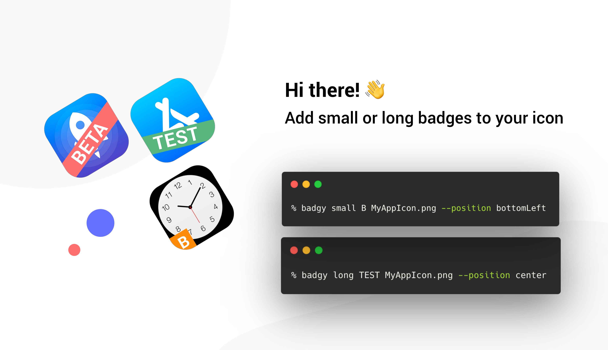

[](https://github.com/arthurpalves/badgy/blob/master/LICENSE)
[](https://developer.apple.com/swift)


<p align="center">

</p>

<p align="center">Badgy is a command line tool that creates variants of your icon by adding badge overlays.</p>

## Features

- ✅ Small (square) and long (rectangular) labels
- ✅ Position it on `top, left, bottom, right, topLeft, topRight, bottomLeft, bottomRight, center`
- ✅ Supports rotation (long badge only)
- ✅ Converts your icon to different sizes already

## Disclaimer

This tool is **NOT** meant to create production ready icons. As I see myself constantly using at least 4 variants of the same application for B2B customers (think of 1 environment for DEV, QA, UAT, PROD and more), I quickly created this tool to differentiate the application icon for those variants.

There are many things that might not work as you expect, and there are many others that you wish this could do. Feel free to contribute to the project and make it better.

## Dependency

This tool depends on `ImageMagick`. If not installed with `brew` make sure to install this dependency yourself:
```sh
brew install imagemagick
```

## Installation

### Homebrew (recommended)

```sh
brew tap arthurpalves/formulae
brew install badgy
```

### [Mint](https://github.com/yonaskolb/Mint)

```sh
mint install arthurpalves/badgy
```

### Make

```sh
git clone https://github.com/arthurpalves/badgy.git
cd badgy
make install
```

## Usage

```sh
Usage: badgy <command> [options]

A command-line tool to add labels to your app icon

Commands:
  small           Add small square label to app icon
  long            Add rectangular label to app icon
  help            Prints help information
  version         Prints the current version of this app
```

### Small badge

Small is a square badge containing only 1 character.

```sh
Usage: badgy small <char> <icon> [options]

Add small square label to app icon

Options:
  -h, --help                Show help information
  -p, --position <value>    Position on which to place the badge
  -v, --verbose             Log tech details for nerds
```

Example
```sh
badgy small B ~/MyIcon.png --position topRight
```

### Long badge

Long is a rectangular badge containing up to 4 characters.

```sh
Usage: badgy long <labelText> <icon> [options]

Add rectangular label to app icon

Options:
  -a, --angle <value>       Rotation angle of the badge
  -h, --help                Show help information
  -p, --position <value>    Position on which to place the badge
  -v, --verbose             Log tech details for nerds
```

Example
```sh
badgy long BETA ~/MyIcon.png --angle 15 --position topLeft
```

## License

Badgy is released under the MIT license. See [LICENSE](https://github.com/arthurpalves/badgy/blob/master/LICENSE) for more information.
